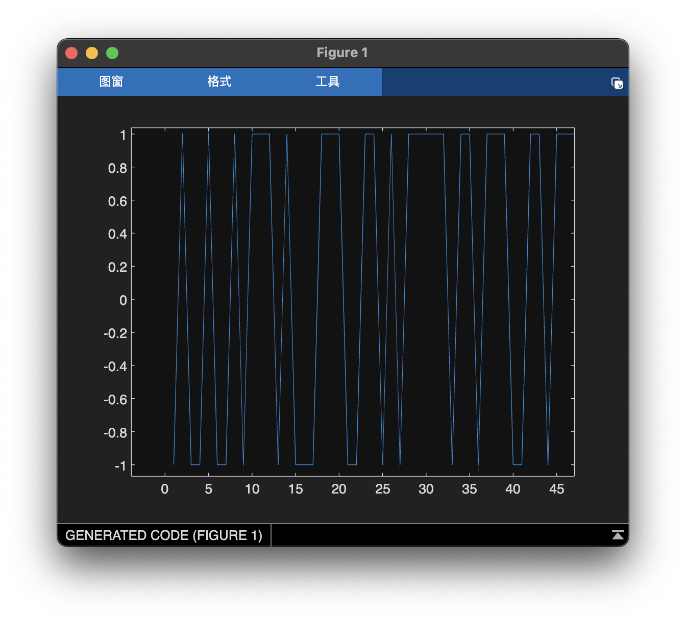
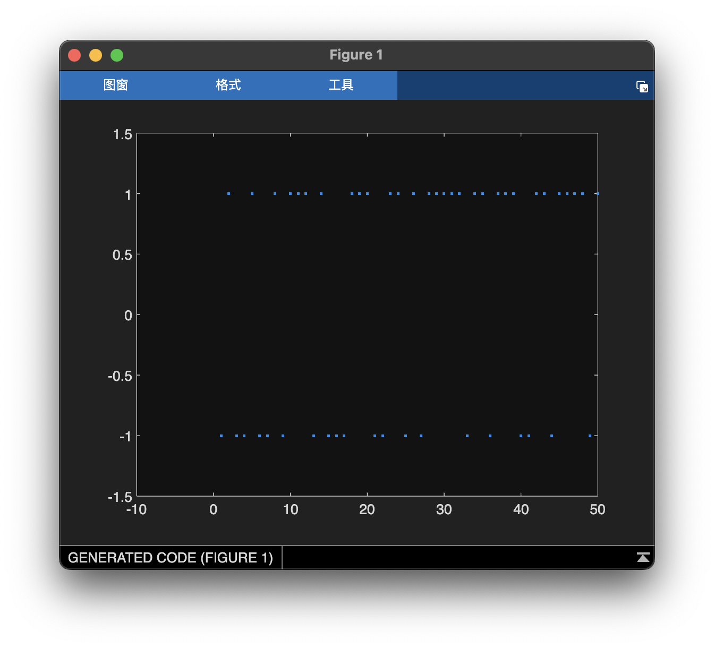
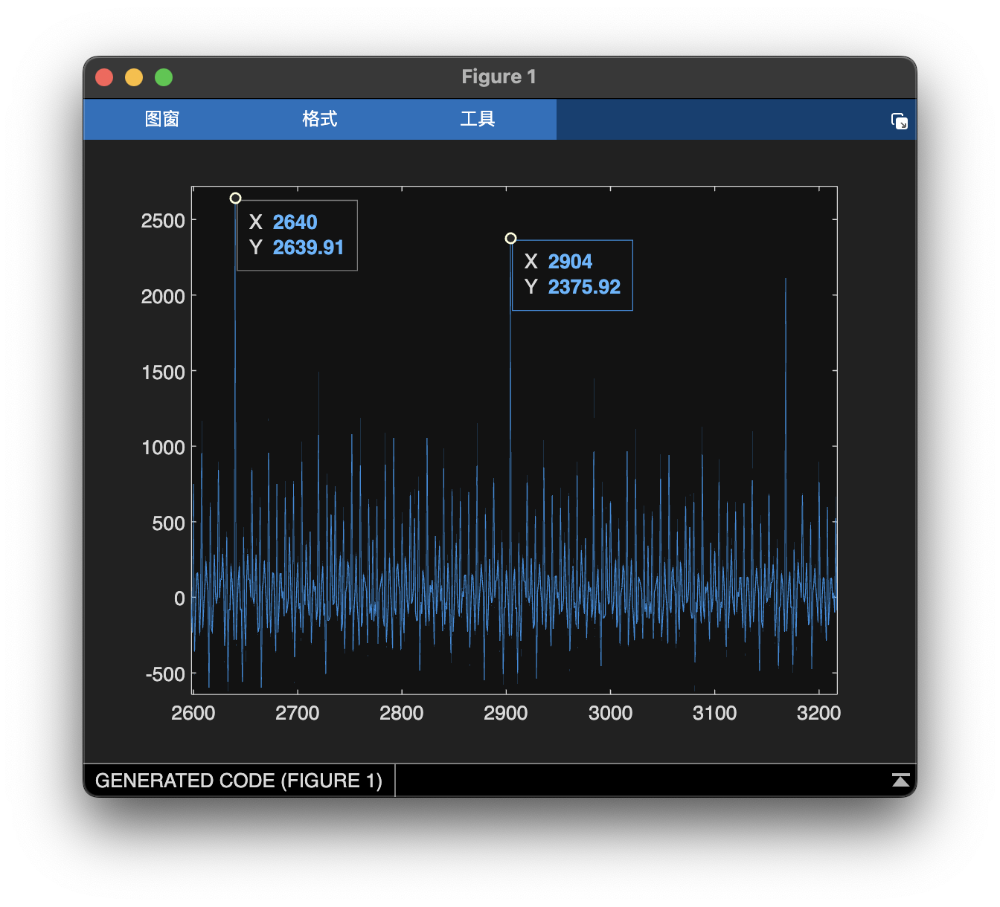

# Red40-Maxxing Writeup
---

### Summary

This was intended to be a beginner difficulty RF challenge. It was designed to introduce you to the idea of how digital data can be encoded on a wave and give people a chance to learn how to process `wav` files in their language of choice. It ended up getting many solves so I was overall happy with how it turned out. However in the future I will probably edit the description to point out that it is a beginner challenge, for the RF category specifically, and not necessarily as easy as other beginner challenges.

#### Description: 
I picked up this signal coming from a Bikini Bottom computer, but I have no idea what it means. Can you help me demodulate it?

(The signal has been shifted to baseband. The signal contains an english sentence repeated several times. Enter the key as `UMASS{<some_sentence_here>}`, where everything between the angle brackets has been replaced with the lowercase version of the sentence that was transmitted. Example if `Hello_there` was transmitted the key would be `UMASS{hello_there}`)."

#### Flag: UMASS{its_not_just_a_boulder_its_a_rock}

---

### Writeup

This write up assumes very little RF knowledge since this was the intro challenge.

File tells us it is a `wav` file using 16 bit signed integer samples with a 1Hz sampling rate. The sampling rate is irrelevant for this challenge (hence the unreasonably low sampling rate), however the 16 bit signed integer samples may be relevant depending on what library you use to process the file.

```sh
$ file red40-maxxing.wav 
red40-maxxing.wav: RIFF (little-endian) data, WAVE audio, Microsoft PCM, 16 bit, mono 1 Hz
```

There are many ways to view a `wav` file however for RF related tasks I prefer to use Matlab due to its robust set of functions for doign mathematical analysis and displaying the results.

The first thing to do is to take a look at the file. (Note that this is the later release of the file, I removed the noise from it at the 24 hour mark because it only had a handful of solve.) 



It looks like there is only two levels that it moves back and forth from. If we plot it again without the connecting lines we can confirm this.



Looking at the autocorrelation of the signal we can see that there is clearly some structure in the wave. It appears to have the largest spikes at 264 sample intervals with smaller ones at every 8 samples.

Aside: Correlation is a measure of how similar one sequence is to another. We can use it to find repeating structure in signals. It is calculated by sliding two copies of the message over each other at all possible overlaps and then multiplying them together. The result of this operation is that when the signals are similar there will be a very positive correlation result, when they are similar but one is inverted there will be a very negative correlation, when they are not similar there will be a near zero correlation. Autocorrelation is correlation between two copies of the same signal. If a signal has a repeating structure it will show up as spikes at multiples of the structure length.



Matlab says that 264 factors to

```matlab
>> factor(264)

ans =

     2     2     2     3    11
```

We see the factor of 8 again along with some other stuff (probably the length of the message, since we know it repeats) so there is a good chance that the flag is being transmitted as ascii data in the signal. In order to get binary ascii data we need to figure out how to get 1s and 0s out of this wave. We already saw that it only has two different levels so let's try the easy thing and assume the high level is a 1 and the low level is a 0.

Aside: this technique is called Binary Phase Shift Keying (BPSK). The name is complex and so is the actual definition, however as you can see the implementation can be quite simple (even though this is sort of a degenerate form of BPSK to make it easier). Wikipedia has a good article on [BPSK](https://en.wikipedia.org/wiki/Phase-shift_keying). The gist is that a wave is transmitted either upright or inverted depending on whether we're sending a 1 or a 0. In this case, because I'm sampling the (cos) wave at one sample per wave, you don't really see the wave, just where it "starts", which is either a 1 or a -1 depending on whether it has been sent upside down or not. This is practically easy to build and also easy to comprehend, making it good for simple transmitters and beginner RF challenges :)

The script below is written in Matlab but intentionally somewhat generic in order to make it easier to port to other languages.

```matlab
% Read in the wav data
recovered_samples = audioread("red40-maxxing.wav");
% Declare space for the bits ahead of time (reduces array resizing)
recovered_bits = zeros(length(recovered_samples), 1);
% Loop over all samples and conver to bits
for i = 1:length(recovered_bits)
    % We arbitrarily assumed negatives were 0s and positives were 1s
    if recovered_samples((i - 1) + 1) < 0
        recovered_bits(i) = 0;
    else
        recovered_bits(i) = 1;
    end
end
% Display the result
disp(bin2char(recovered_bits));
% Function I got found on StackOverflow to convert binary to a string
function origchar = bin2char(binvec)
   origchar = char(reshape(bin2dec(reshape(char(binvec + '0'),8,[]).'),1,[]));
end
```

And just like that we get the flag, repeated several times as described.

```matlab
>> red40Maxxing
Its_not_just_a_boulder_its_a_rockIts_not_just_a_...
```

As a shameless plug for Matlab here is how taking advantage of its signals processing library can drastically simplify the script (if you know that this is a kind of phase shift keying). (The not is necessary because for me at least it decoded it with the bits flipped.)

```matlab
recovered_samples = audioread("red40-maxxing.wav");
disp(bin2char(not(pskdemod(recovered_samples, 2))));
```