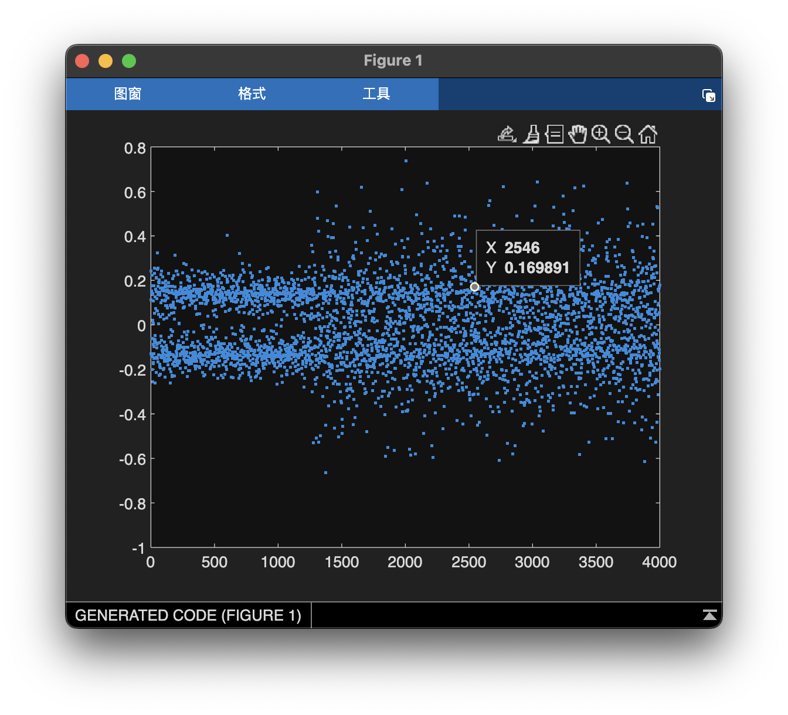

# Yellow5-Maxxing Writeup
---

### Summary

This was actually intended to be the medium difficulty challenge, so it's fair to say that the results of the CTF surprised me quite a bit. It was intended to build on the BPSK techniques learned in `red40-maxxing` and add a little extra on top to deal with having a noisy channel. In retrospect, all of these RF challenges were blind (kind of a necessity as showing the source code makes it trivial to write a solve script), so relying on noise to increase difficulty was a bad idea. Especially considering that the majority of the people solving them had little to no RF experience, so the things that would help me would not be obvious to them. Live and learn. I was happy to see that it got one solve, `geza3D` is a G.

#### Description: 
I picked up another signal coming from a Bikini Bottom computer, but this time it is full of noise, it's spectrum is all spreadout. Can you help me demodulate it?

(The signal has been shifted to baseband. The signal contains an english sentence repeated several times. Enter the key as `UMASS{<some_sentence_here>}`, where everything between the angle brackets has been replaced with the lowercase version of the sentence that was transmitted. Example if `Hello_there` was transmitted the key would be `UMASS{hello_there}`)."

#### Flag: UMASS{krusty_krab_pizza_is_the_pizza_for_you_and_me}

---

### Writeup

As with the last wave the first thing to do is to take a look at the wave.


Yikes. There's clearly something different going on at the beginning that changes as the signal goes on, but it's not clear what it is. Plotting the points reveals that the sample has two different levels again. Naively running the same code we used for `red40-maxxing` produces gibberish so we need to try something else. It may be doing BPSK again, however there is clearly more noise this time.



Plotting the points confirms that there is a difference between the beginning of the signal and the rest of it, so let's take a look at it.


Autocorrelation reveals that there is structure in this part of the wave (sample 1 to 1000 ish). It appears that there is a pattern! It seems like a 31 bit pattern is repeated over and over with every other repitition being inverted. It's likely it is some sort of training sequence.

Aside: One of the hardest problems in RF communication is synchronization between the transmitter and the receiver. In order to achieve it, many RF protocols have the transmitter send a series of training bits before transmitting the actual message content. This gives the receiver time to figure out how fast the transmitter is transmitting and lock onto its signal in time.

If we correlate across the entire signal we can see that there is more interesting structure. With some repeating structure every 11160 samples. Which factors to `2 * 2 * 2 * 3 * 3 * 5 * 31`. There's that 31 structure again!


Zooming in on the smaller spikes reveals more structure, repeating every 248 samples, which factors to `2 * 2 * 2 * 31`. 31 again! Perhaps it is repeating throughout the entire message, not just the beginning. We also see the factor of 8 again, assuming it's transmitting ascii again, that likely corresponds to the fact that every eigth bit has to be 0.


Let's try correlating the 31 bit sequence against the signal. We know it repeats the pattern several times at the beginning so let's just correlate against the first 31 samples.


It is a little hard to tell the spikes from the rest of the signal, but looking at where we believe the message to start we can see that we do tend to get spikes at nice multiple of 31. It's not solid proof but it's encouraging. Let's write a script to take the dot product of the first 31 samples with signal at every 31 sample interval. We'll guess that a positive correlation means a 1 and a negative correlation means a 0.

```matlab
% Read in wav data
recovered_samples = audioread("yellow5-maxxing.wav");
% Declare space ahead of time
recovered_bits = zeros(length(recovered_samples) / 31, 1);
% Loop over every 31 bit segment
for i = 1:length(recovered_bits)
    start_bit = (i - 1) * 31 + 1;
    % We arbitrarily assumed that the first 31 samples were a 1
    % so positive correlation indicates a 1 bit, negative correlation
    % indicates a 0 bit
    if dot(recovered_samples(start_bit:start_bit + 30), recovered_samples(1:31)) > 0
        recovered_bits(i) = 1;
    else
        recovered_bits(i) = 0;
    end
end
% Display results (see red40-maxxing write up for bin2char source code)
disp(bin2char(recovered_bits(41:end)));
```

And just like that, we recover the message (after trimming the training bits).

```matlab
>> yellow5Maxxing
Krusty_Krab_pizza_is_the_pizza_for_you_and_meKrusty_Krab_pizza...
```

And here is the matlab solution. The only real difference is using the pskdemod function to turn the noise wave into nice 1s and 0s first. Since we were using correlation to extract the message bits anyway this really doesn't change much. It's important that we still use the dot product as the noise will still corrupt bits in the message, resulting in bit flips.

```matlab
recovered_symbols = pskdemod(recovered_samples, 2) * 2 - 1;
for i = 1:length(recovered_bits)
    start_bit = (i - 1) * 31 + 1;
    if dot(recovered_symbols(start_bit:start_bit + 30), recovered_symbols(1:31)) > 0
        recovered_bits(i) = 1;
    else
        recovered_bits(i) = 0;
    end
end
disp("Good (matlab): ");
disp(bin2char(recovered_bits(41:end)));
```

Aside: This technique of transmitting a bit as an upright or inverted series of bits is called Direct Sequence Spread Spectrum ([DSSS](https://en.wikipedia.org/wiki/Direct-sequence_spread_spectrum)). It is a form of redundancy, commonly used as a way to fight noise as we saw in this challenge. One notable way this is used is in anti-jamming technology. If you were to take a spectrogram of the signal it would look like this:


The power of transmission is spread out across the entire spectrum which means that you would have to jam the entire bandwidth to stop this transmission. This is both harder and more expensive. For a similar reason, it is hard to detect that someone is transmitting in the first place, if they are using DSSS. These techniques all made it particularly interesting  for military communication. Indeed the first widespread uses of DSSS were in military communication, notably GPS (yes the GPS you use everyday, google the specs, they're public knowledge). In addition DSSS continues to see everyday use through the CDMA system used by nearly all modern wireless communication protocols (WiFi, Bluetooth, BLE).
