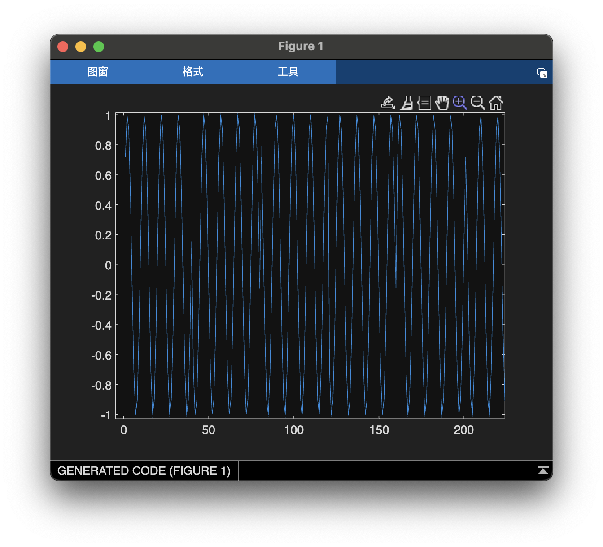
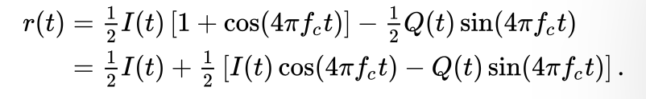

# Yellow6-Maxxing Writeup
---

### Summary

This was intended to be the hardest challenge, because it used the most complex modulation scheme. It was designed to teach people about Quadrature Phase Shift Keying (QPSK), an higher throughput version of BPSK (four states instead of 2 means you can send bits twice as fast). Contrary to my expectation, this actually ended up being the medium difficulty challenge, and I was very impressed with the solves saw. You may not have known it at the time but all of the "pattern" based solves I saw were using QPSK techniques (more or less) to decode the message :)

#### Description: 
I picked up this signal coming from a Bikini Bottom computer, except this one seems like it has twice as much information as the last one. Can you help me demodulate it?

(The signal contains an english sentence repeated several times. Enter the key as `UMASS{<some_sentence_here>}`, where everything between the angle brackets has been replaced with the lowercase version of the sentence that was transmitted. Example if `Hello_there` was transmitted the key would be `UMASS{hello_there}`)."

#### Flag: UMASS{hiiii_kevin}

---

### Writeup

As mentioned above, this is by far the most complex modulation scheme used for these challenges. Although BPSK and QPSK sound (and are ultimately) quite similar, the logical jump required to send two bits per bit period as opposed to 1 is large. That being said if you can follow all the way through this write up you will be well on your way towards being an RF engineer.

Let's begin at the beginning. Plotting the wave reveals an interesting pattern. This time instead of discrete samples we can see a wave with a little bit of distortion here and there.



Counting visually we can see that the jumps are very regular. They occur only at multiples of 40 samples and the waves always cycle 4 times per 40 sample increment. Interesting, let's keep looking. Plotting the second sample after every jump (so every 40th sample starting at 2) reveals that the jumps only occur in 4 places. With these two peices of information we can reasonably assume that some sort of phase modulation is taking place, more than likely QPSK (quad for 4). 


What is QPSK? Time for some theory. Beware here be math.

---

Let's start by understanding all the words in quadrature phase shift keying. 
- Skipping quadrature for now, phase is a measure of what part of its cycle a wave is in. If you think about the common point-on-wheel definition of a sine wave, phase is the point on the wheel that the wave is in at a given moment in time. It is measured out of 360 degrees or out of 2π radians, just like sine waves are. The image below shows two waves that are π/4 radians phase shifted, relative to one another.


- Shift keying is exactly what it sounds like. We can change the phase of wave between different states to transmit binary data. BPSK does this with only two states, spaced 180 degrees apart. Trace a sine wave with your finger starting at 0 degrees and then at 180 degrees and you will see that you end up drawing two waves where one is flipped upside down relative to the other. This is what you saw in red40-maxxing. However if phase is just points on a circle, we can pick from four points to transmit twice as much data. (With even more states you could send even more data, although around 16 states the points begin to be too close to each other to reliably tell them apart (128-PSK challenge?)).
- Now for quadrature. Simply put two waves are "in quadrature" if they have a phase difference of exactly 90 degrees, like the two shown above. An interesting point is that a sine wave with a 90 degree phase offset looks exactly like a cosine wave. In fact it is a cosine wave, so a cosine wave and a sine wave are always in quadrature (assuming they have the same phase offset).

Let's explore some properties of waves in quadrature. If you multiply them together, they produce another wave. Any phase shift from 0 to 180 besides 90 will produce a wave with some bias, meaning that it isn't centered around zero as seen in the bottom picture below. Anything from 180 to 360 is just the mirror image of a wave we saw in the 0 to 180 range, so we can ignore that half and focus on 90 to 180.


If you take some liberties with the definition of an integral, we can say that the integral of a wave centered around 0 is 0, because the top half of each cycle cancels the bottom half of that cycle. In other words a sin wave and a cosine wave multiply to 0, in mathematical terms this is called orthogonality and it produces some interesting properties.

Specifically, if two things are orthogonal that means (loosely) that you can make a [linear combination](https://en.wikipedia.org/wiki/Linear_combination#:~:text=In%20mathematics%2C%20a%20linear%20combination,a%20and%20b%20are%20constants). of them (i.e. add them together scaled by seperate constants) to make any possible thing in the set of things they came from. For example the vectors (1, 0) and (0, 1) are orthogonal and therefore any point in the 2d plane can be written as a *unique* linear combination of them. Conversely, any point in the 2d plane can be *uniquely* decomposed into a combination of (1, 0) and (0, 1). Now it's possible to see why waves in quadrature are so interesting. They can be linearly combined to produce a sine wave **in any phase**, as shown below. All of these graphs were taken with [desmos](https://www.desmos.com/calculator), an excellent, free, online calculator. I highly recommend playing around with a graph like the one below to see what I mean by creating waves of any phase.


If we use the 0s and 1s of a message, turn them into -1s and 1s respectively, we can use pairs of them as the coefficients for the two waves and create a QPSK wave. Success!

Almost. You still need a way to recover the message bits. So how do we do that? Well for that we need a little more math. This comes from the Wikipedia page on [Quadrature Amplitude Modulation](https://en.wikipedia.org/wiki/Quadrature_amplitude_modulation) (QAM), a more advanced form of QPSK, however the math is still relevant. By convention the cosine portion of the wave is referred to as the In-phase portion and the sine portion of the wave is referred to as the Quadrature portion. This distinction is purely nominal, as of course anything that looks like a sine wave looks like a cosine wave when shifted 90 degrees. If we model the QPSK signal using that convention we get:


Then we can multiply the received signal by the same cosine and sine wave as follows:


With a little trig identity application and some algebra we get:



The main takeaway from that is the `1/2I(t)` part. That is the data we used to modulate the message at half of it's original amplitude, while the carrier waves are also there at half their amplitude and twice their original frequency. We can see exactly that in the picture below. That multiplying the red QPSK wave by the same carrier produces the purple and black waves which have twice the frequency, exactly as predicted. The coefficients of the I and Q portion are I and Q respectively and if you look carefully you can see that the purple and black waves are centered at -0.25 and 0.5 respectively, or exactly half the values of their respective coefficients, exactly as expected. Math. Unreasonably effective at describing the real world. 


You may notice that the purple and black waves oscillate even though I and Q don't. But remember those waves are only part I and Q, the other part is the carrier waves at twice their original frequency. Imagine removing the oscillations from each, you would be left with a flat line where the wave is centered, perfectly recovering I and Q.

These oscillations can be removed easily in software with a tool called the Fourier Transform (commonly implemented particularly efficiently as the Fast Fourier Transform (FFT)) or in hardware with a low-pass filter.

Aside: The Fourier Transform is probably the single most useful and most frustrating to understand part of RF. It splits any signal into the pure sine waves that can be added together to recreate it. It does this (roughly) by taking waves of different frequencies, multiplying them against the signal, and then integrating the product. If that frequency is present in the signal, then you will get a sine squared wave which is all positive, so the integral will be positive. If that frequency is not present in the signal, then you will get the products of two sines wich is  another wave that oscillates about 0, so the integral will be near zero. Simple (ish) right. Wrong. As with many fields in math the true beauty of the algorithm is in your interpretation of the outputs. It turns out that with the right interpretation you can use the Fourier Transform to, remove noise from signals, multiply plynomials, compress images, compute fast Chebyshev approximations, and much more. Understanding the Fourier Transform in at least one of these applications is essential to RF. I particularly like this [video](https://www.google.com/url?sa=t&source=web&rct=j&opi=89978449&url=https://www.youtube.com/watch%3Fv%3Dh7apO7q16V0&ved=2ahUKEwiJurvI2vCFAxXEFVkFHdGGCxoQtwJ6BAgQEAI&usg=AOvVaw3l8Hek_9PzkZ-7pJttPuxf).

Removing those high frequency oscillations, leaves us with just the I and Q coefficients which we can assemble into our transmitted data.

Aside: As you have seen there is some similarity between the sine and cosine coefficients and x-y coordinate pairs. In fact RF engineers often plot the points received by their demodulator as (I, Q) pairs on a graph. This is called a constellation. The constellation lets them visualize the noise in the message being transmitted. Tightly grouped clusters, with lots of space between each cluster indicates a clean transmission. Noise will cause them to blur and run into each other. Below is an example of a clean QPSK constellation. Typically constellations space all of their points out equally along the unit circle (at least for PSK). Since we're using 4 points they should be spaced at 90 degree intervals. Fortunately, since we're using 1 and -1 as our coefficients we automatically get points spaced at 90 degree intervals starting from 45 degrees (π/4, 3π/4, 5π/4, 7π/4) just like the picture below.


Aside: One last interesting detail is how RF engineers assign a bit pattern to each of the constellation points. For example should the IQ point (1, 1)  correspond to message bits 0b11, or something else? Any assignment is valid, however it is often useful to assign the points such that each pair of corresponding message bits is only one bit different from each of its neighbors. As an example, the above constellation might say that (-1, 1) corresponds to 0b00, (1, 1) corresonds to 0b10, (1, -1) corresponds to 0b11, and (-1, -1) corresponds to 0b01. The advantage of this is that if noise induces an error in the demodulator, the recovered message bits likely only have a one bit error, because the noise is most likely to push the received point to one of its immediate neighbors. A code like this is called a Gray code, after the person who invented it.

---

Okay theory over. We know how (and why) QPSK works, and how to build a demodulator to recover the message bits.

Taking another look at the signal we can see that the "distortion" we saw earlier is actually just phase changes in the wave.


Now you can understand why I plotted every 40th sample starting from the second one. Every 40 samples the phase changes, so we would expect to see the 4 distinct levels that the wave starts at. The one caveat to that is that if the wave starts at +/- π/4 and +/- 3π/4 then we will only see two levels, one positive and one negative, because of the symmetry of a sine wave at +/- 90 degrees. So instead we start from the second sample of the cycle, which will be either increasing or decreasing relative to the starting sample, in addition to being either positive or nagative. This gives us four different possible levels, and indeed that is exactly what we see.


The most important part of our demodulator is finding the right carrier frequency to multiply the signal by. Fortunately the signal is very clean and we were already able to identify that the wave peaks 4 times per 40 samples, or in other words there are 10 samples per wave (you can confirm this with a spectrogram). Once you know that, you should be able to write a script to generate the waves, multiply against the signal, and then recover the bits. Remember that after recovering the bits, if you are getting a nice repeating pattern but the pattern is not ascii, you should try different mappings between IQ points and message bits, starting with Gray codes.

Below is my solve script with comments that should connect to what I talked about above and explain what it's doing. It doesn't use many Matlab library functions so it should be easier to port it to another language.

```matlab
IQ_SAMPLE_RATE = 40;
GRAY_CODE = [0 1 3 2];
% Read in the signal
recovered_samples = audioread("three.wav");
% Generate a wave that oscillates every 10 samples
% and lasts long enough to cover the entire signal
t = 0:2 * pi / 10:2 * pi * length(recovered_samples) / 10 - (2 * pi / 10);
I = cos(t);
Q = sin(t);
% Create a low pass filter to remove the higher frequency parts
[b, a] = butter(6, 0.1);
% Recover I/Q samples and then low pass to get the bit streams
recovered_I = filter(b, a, real(recovered_samples.' .* I));
recovered_Q = filter(b, a, real(recovered_samples.' .* Q));
% Reserve space for recovered bits
recovered_I_bits = zeros(1, length(recovered_I) / IQ_SAMPLE_RATE);
recovered_Q_bits = zeros(1, length(recovered_Q) / IQ_SAMPLE_RATE);
% Loop through samples (by looping over I/Q recovered bits) and scaling by
% sample rate
for i = 1:length(recovered_I_bits)
    pos = IQ_SAMPLE_RATE * (i - 1) + IQ_SAMPLE_RATE / 2;
    if recovered_I(pos) > 0
        recovered_I_bits(i) = 1;
    else
        recovered_I_bits(i) = 0;
    end
    if recovered_Q(pos) > 0
        recovered_Q_bits(i) = 1;
    else
        recovered_Q_bits(i) = 0;
    end
end
% Reshape the bits so that they go IQIQIQIQIQIQ...
recovered_bits = reshape([recovered_I_bits; recovered_Q_bits], 1, []);
% Print the output bits after first translating them according 
% to a Gray code. This is admittedly guessy. You can take an 
% educated guess that the first bits of the message should be 0b01
% which narrows down the search space to just 6 possibilities,
% only 2 of which are valid Gray codes. As it turns out I used,
% [0 1 3 2]
disp(bin2char(graycode(GRAY_CODE, recovered_bits)));

% Translate the input according to the specified Gray code
function binvec = graycode(code, input)
    % Gray string bits
    binvec = zeros(1, length(input));
    for i = 1:2:length(input)
        binvec(i:i+1) = bitget(code(2 * input(i + 1) + input(i) + 1), 1:2);
    end
end
```

And voila there is our message.

```matlab
>> three
Hiiii_KevinHiiii_KevinHiiii_KevinHiiii_KevinHiiii_Kevin...
```

For anyone with Matlab, here is a Matlab based solution. The major difference is that we don't have to write our own demodulator. But where's the fun in that :)

```matlab
% Generate a wave that oscillates every 10 samples
% and lasts long enough to cover the entire signal
t = 0:2 * pi / 10:2 * pi * length(recovered_samples) / 10 - (2 * pi / 10);
I = cos(t);
Q = sin(t);
% Use the built in demodulator (QAM is just a more complex form of QPSK)
recovered_symbols = qamdemod(recovered_I + 1i * recovered_Q, 4, [2 0 3 1]);
recovered_bits = zeros(1, 2 * length(recovered_symbols) / IQ_SAMPLE_RATE);
% Take every 40th sample starting from the 20th. The beginning and end of 
% the sample section can be unreliable.
for i = 1:2:length(recovered_bits)
    pos = IQ_SAMPLE_RATE * (i - 1) / 2 + IQ_SAMPLE_RATE / 2;
    recovered_bits(i:i+1) = bitget(recovered_symbols(pos), 1:2);
end
disp(bin2char(graycode(GRAY_CODE, recovered_bits)));
```

Associated RF resources:
- [https://digilent.com/reference/test-and-measurement/guides/complementary-labs/lab5/start](https://digilent.com/reference/test-and-measurement/guides/complementary-labs/lab5/start) This article covers some of the intricacies of amplitude modulation. QPSK (and QAM) is just amplitude modulation of two different waves in quadrature
- [https://www.jezzamon.com/fourier/index.html](https://www.jezzamon.com/fourier/index.html) Fun Fourier transform intro course
- [https://dsp.stackexchange.com/questions/431/what-is-the-physical-significance-of-negative-frequencies](https://dsp.stackexchange.com/questions/431/what-is-the-physical-significance-of-negative-frequencies) Good Stackoverflow posts on Fourier transform